# Complete Website Development Flowchart: Shelter Link Platform

## 🚀 Project Overview

**Platform:** Government Service Portal for Migrant Workers and Employers  
**Tech Stack:** HTML5, CSS3 (Tailwind), Vanilla JavaScript, Multi-language Support  
**Target Users:** Migrant Workers, Employers, Government Officials

---

## 📋 Phase 1: Project Planning & Architecture

### 1.1 Requirements Gathering

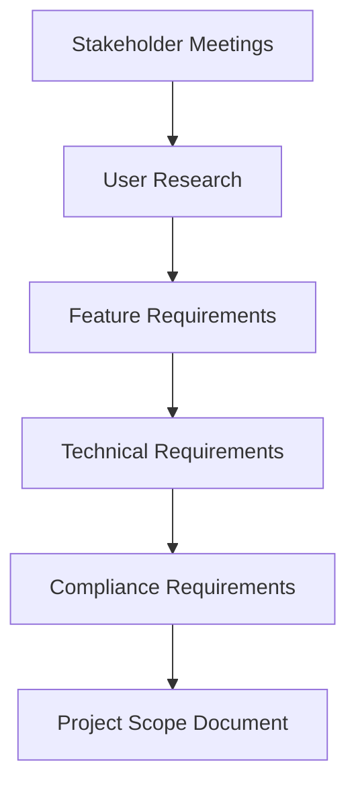

**Key Deliverables:**

- [ ] User personas (Workers, Employers, Officials)
- [ ] Feature requirement document
- [ ] Technical architecture diagram
- [ ] Compliance checklist (Government standards)
- [ ] Multi-language requirements (11 Indian languages)

### 1.2 System Architecture Planning

```
┌─────────────────┐    ┌──────────────────┐    ┌─────────────────┐
│   Frontend      │    │   Backend API    │    │   Database      │
│   (Multi-page   │◄──►│   (Future)       │◄──►│   (Future)      │
│    Static)      │    │                  │    │                 │
└─────────────────┘    └──────────────────┘    └─────────────────┘
         │
         ▼
┌─────────────────┐
│  Static Assets  │
│  • Languages    │
│  • Images       │
│  • Styles       │
└─────────────────┘
```

---

## 🎨 Phase 2: Design & User Experience

### 2.1 Design System Creation

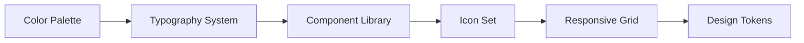

**Components Created:**

- [ ] Navigation bars (fixed, responsive)
- [ ] Cards (job cards, employee cards, service cards)
- [ ] Forms (registration, job posting, application)
- [ ] Modals (job details, applications)
- [ ] Buttons (primary, secondary, outline, danger)
- [ ] Status badges (active, pending, verified)

### 2.2 User Journey Mapping

```
Worker Journey:
Registration → Profile Setup → Job Search → Apply → Interview → Hired
     │              │             │          │         │        │
     ▼              ▼             ▼          ▼         ▼        ▼
Landing → Register → Dashboard → Jobs → Application → Status → Work

Employer Journey:
Registration → Company Setup → Post Jobs → Review Applications → Hire
     │              │             │            │                 │
     ▼              ▼             ▼            ▼                 ▼
Landing → Register → Dashboard → Job Post → Applications → Management
```

---

## 💻 Phase 3: Frontend Development

### 3.1 Project Structure Setup

```
hackathon/
├── 📄 index.html              # Login/Landing page
├── 📄 register.html           # User registration
├── 📄 dashboard.html          # Worker dashboard
├── 📄 employer-dashboard.html # Employer dashboard
├── 📄 jobs.html              # Job listings
├── 📄 welfare.html           # Government schemes
├── 📄 grievances.html        # Complaint system
├── 📄 health.html            # Health services
├── 📄 education.html         # Education services
├── 📄 finance.html           # Financial services
├── 📄 food.html              # Food security
├── 📄 qr.html                # QR code generation
├── 📁 assets/
│   ├── 📁 css/
│   │   └── tailwind-styles.css
│   ├── 📁 js/
│   │   ├── main.js
│   │   ├── language.js
│   │   ├── jobs.js
│   │   ├── welfare.js
│   │   └── grievances.js
│   └── 📁 lang/
│       ├── en.json
│       ├── hi.json
│       ├── bn.json
│       ├── te.json
│       ├── ta.json
│       ├── mr.json
│       ├── gu.json
│       ├── kn.json
│       ├── ml.json
│       ├── pa.json
│       └── or.json
└── 📄 README.md
```

### 3.2 Development Workflow

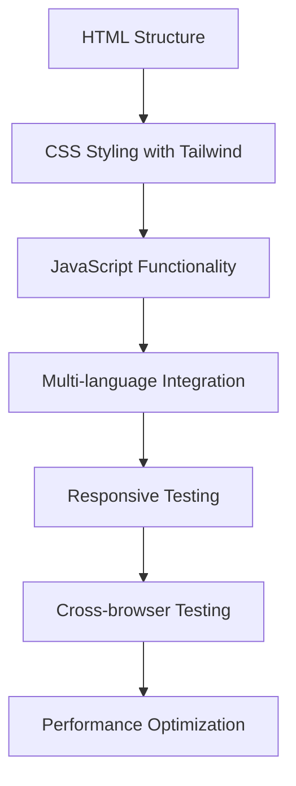

### 3.3 Page Development Order

1. **Foundation Pages** (Week 1)

   - [ ] `index.html` - Login system with user type selection
   - [ ] `register.html` - Registration forms for workers/employers
   - [ ] Base CSS setup with Tailwind configuration

2. **Core Dashboards** (Week 2)

   - [ ] `dashboard.html` - Worker dashboard with services
   - [ ] `employer-dashboard.html` - Employer management interface
   - [ ] Navigation and layout components

3. **Service Pages** (Week 3)

   - [ ] `jobs.html` - Job listings with search/filter
   - [ ] `welfare.html` - Government schemes portal
   - [ ] `grievances.html` - Complaint management system

4. **Additional Services** (Week 4)
   - [ ] `health.html` - Healthcare services
   - [ ] `education.html` - Educational resources
   - [ ] `finance.html` - Financial services
   - [ ] `food.html` - Food security programs
   - [ ] `qr.html` - QR code generation for workers

---

## 🌐 Phase 4: Multi-language Implementation

### 4.1 Language System Architecture

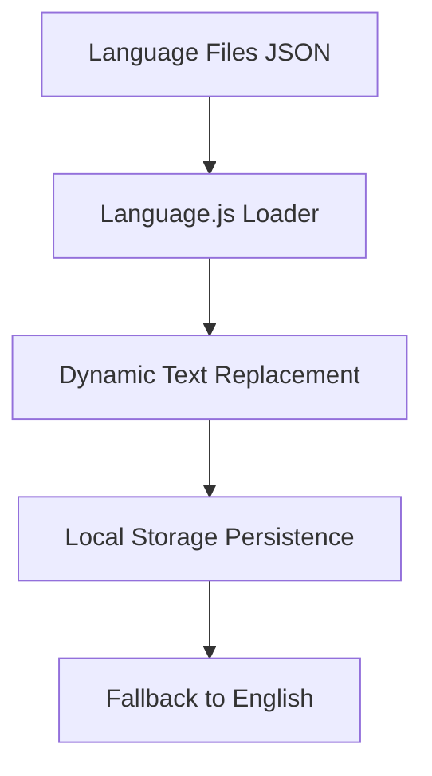

### 4.2 Language Implementation Process

1. **Create Language Files**

   ```json
   {
     "welcome_message": "Welcome to Shelter Link",
     "login_button": "Login",
     "register_link": "Register here"
   }
   ```

2. **HTML Markup**

   ```html
   <h1 data-translate="welcome_message">Welcome to Shelter Link</h1>
   <button data-translate="login_button">Login</button>
   ```

3. **JavaScript Integration**
   ```javascript
   function applyTranslations() {
     document.querySelectorAll("[data-translate]").forEach((element) => {
       const key = element.getAttribute("data-translate");
       if (translations[key]) {
         element.textContent = translations[key];
       }
     });
   }
   ```

### 4.3 Supported Languages

- [ ] English (en) - Base language
- [ ] Hindi (hi) - हिंदी
- [ ] Bengali (bn) - বাংলা
- [ ] Telugu (te) - తెలుగు
- [ ] Tamil (ta) - தமிழ்
- [ ] Marathi (mr) - मराठी
- [ ] Gujarati (gu) - ગુજરાતી
- [ ] Kannada (kn) - ಕನ್ನಡ
- [ ] Malayalam (ml) - മലയാളം
- [ ] Punjabi (pa) - ਪੰਜਾਬੀ
- [ ] Odia (or) - ଓଡ଼ିଆ

---

## ⚡ Phase 5: JavaScript Functionality Development

### 5.1 Core JavaScript Modules

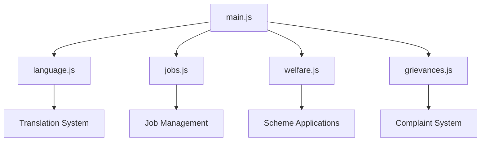

### 5.2 Feature Implementation Roadmap

#### 5.2.1 Authentication & User Management

```javascript
// Features to implement:
- User type selection (Worker/Employer)
- Login form validation
- Registration with different forms
- Session management (localStorage)
- Profile management
```

#### 5.2.2 Job Management System

```javascript
// jobs.js functionality:
- Job listing display
- Search and filter functionality
- Job application process
- Application status tracking
- Employer job posting
- Application management
```

#### 5.2.3 Welfare Scheme Management

```javascript
// welfare.js functionality:
- Scheme categories display
- Scheme details modal
- Application form handling
- Application status tracking
- Document upload simulation
```

#### 5.2.4 Grievance System

```javascript
// grievances.js functionality:
- Complaint form submission
- Issue categorization
- Status tracking
- Priority handling
- Resolution updates
```

### 5.3 Data Management Strategy

```
Local Storage Structure:
├── selectedLanguage
├── userType (worker/employer)
├── userProfile
├── jobApplications
├── welfareApplications
├── grievances
└── sessionData
```

---

## 📱 Phase 6: Responsive Design Implementation

### 6.1 Breakpoint Strategy

```css
/* Tailwind CSS Breakpoints */
sm: 640px   /* Mobile landscape */
md: 768px   /* Tablet */
lg: 1024px  /* Desktop */
xl: 1280px  /* Large desktop */
2xl: 1536px /* Extra large */
```

### 6.2 Component Responsiveness

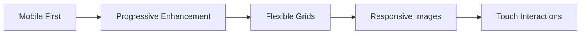

**Responsive Elements:**

- [ ] Navigation (hamburger menu on mobile)
- [ ] Cards (stacked on mobile, grid on desktop)
- [ ] Forms (single column on mobile)
- [ ] Modals (full screen on mobile)
- [ ] Tables (horizontal scroll on mobile)

---

## 🎯 Phase 7: User Experience Features

### 7.1 Interactive Elements

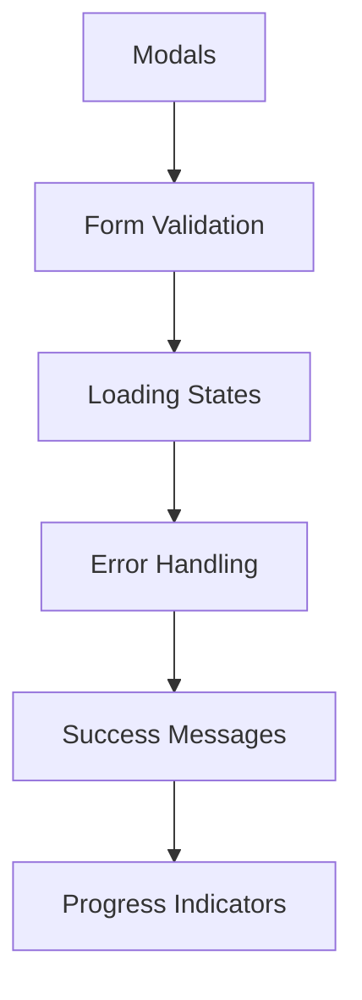

### 7.2 UX Enhancements

- [ ] **Smooth Animations**: Hover effects, transitions
- [ ] **Loading States**: Skeleton screens, spinners
- [ ] **Error Handling**: Validation messages, retry mechanisms
- [ ] **Accessibility**: ARIA labels, keyboard navigation
- [ ] **Notifications**: Toast messages, status updates

### 7.3 Performance Optimizations

```
Optimization Techniques:
├── Image optimization
├── CSS minification
├── JavaScript bundling
├── Lazy loading
├── Caching strategies
└── Code splitting
```

---

## 🔧 Phase 8: Testing & Quality Assurance

### 8.1 Testing Strategy

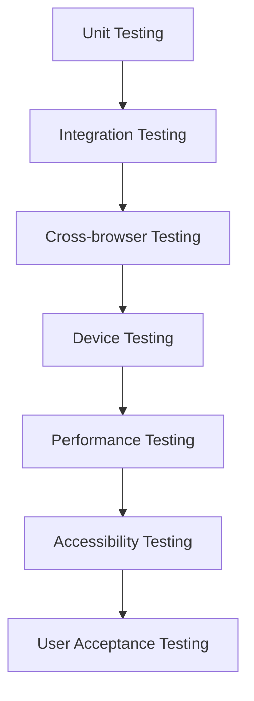

### 8.2 Testing Checklist

**Functionality Testing:**

- [ ] All forms submit correctly
- [ ] Navigation works across all pages
- [ ] Language switching functions properly
- [ ] Modals open/close correctly
- [ ] Search and filter features work
- [ ] Local storage persistence

**Cross-browser Testing:**

- [ ] Chrome (latest)
- [ ] Firefox (latest)
- [ ] Safari (latest)
- [ ] Edge (latest)
- [ ] Mobile browsers

**Device Testing:**

- [ ] Desktop (1920x1080, 1366x768)
- [ ] Tablet (iPad, Android tablets)
- [ ] Mobile (iPhone, Android phones)
- [ ] Various screen sizes

**Accessibility Testing:**

- [ ] Screen reader compatibility
- [ ] Keyboard navigation
- [ ] Color contrast ratios
- [ ] Font size readability
- [ ] ARIA labels

---

## 🚀 Phase 9: Deployment & Launch

### 9.1 Deployment Strategy

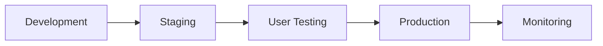

### 9.2 Hosting Options

1. **Static Hosting** (Current Approach)

   - GitHub Pages
   - Netlify
   - Vercel
   - AWS S3 + CloudFront

2. **Future Full-Stack** (With Backend)
   - AWS EC2 + RDS
   - Google Cloud Platform
   - Azure App Service
   - Traditional VPS

### 9.3 Pre-Launch Checklist

- [ ] All pages tested and functional
- [ ] Multi-language support verified
- [ ] Mobile responsiveness confirmed
- [ ] Performance optimized
- [ ] SEO meta tags added
- [ ] Analytics implemented
- [ ] Error tracking setup
- [ ] Backup procedures in place

---

## 🔄 Phase 10: Maintenance & Future Enhancements

### 10.1 Ongoing Maintenance

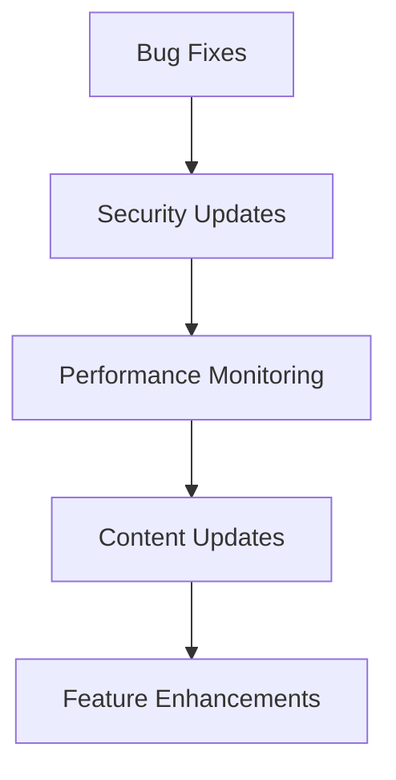

### 10.2 Future Roadmap

**Short-term (3-6 months):**

- [ ] Backend API development
- [ ] Database integration
- [ ] Real user authentication
- [ ] File upload functionality
- [ ] Email notifications

**Medium-term (6-12 months):**

- [ ] Mobile app development
- [ ] Advanced analytics dashboard
- [ ] Integration with government APIs
- [ ] Payment gateway integration
- [ ] SMS notifications

**Long-term (1+ years):**

- [ ] AI-powered job matching
- [ ] Video interview system
- [ ] Advanced reporting tools
- [ ] Multi-tenant architecture
- [ ] API for third-party integrations

---

## 🛠️ Development Tools & Technologies

### 10.3 Frontend Stack

```
HTML5: Structure and semantics
CSS3: Styling and animations
Tailwind CSS: Utility-first framework
JavaScript (ES6+): Interactive functionality
Font Awesome: Icon library
```

### 10.4 Development Tools

```
Code Editor: VS Code
Version Control: Git + GitHub
Browser DevTools: Chrome, Firefox
Design: Figma (for mockups)
Testing: Manual testing + browser tools
```

### 10.5 Future Backend Stack (Recommended)

```
Runtime: Node.js
Framework: Express.js / FastAPI
Database: PostgreSQL / MongoDB
Authentication: JWT
File Storage: AWS S3
Caching: Redis
```

---

## 📊 Success Metrics & KPIs

### 10.6 Key Performance Indicators

```
User Metrics:
├── User registration rate
├── Job application completion rate
├── Employer job posting rate
├── Multi-language usage stats
└── Mobile vs desktop usage

Technical Metrics:
├── Page load times
├── Mobile responsiveness score
├── Cross-browser compatibility
├── Accessibility compliance
└── Error rates
```

### 10.7 Analytics Implementation

- [ ] Google Analytics setup
- [ ] User journey tracking
- [ ] Conversion funnel analysis
- [ ] Language preference analytics
- [ ] Device/browser usage stats

---

## 🔒 Security & Compliance

### 10.8 Security Considerations

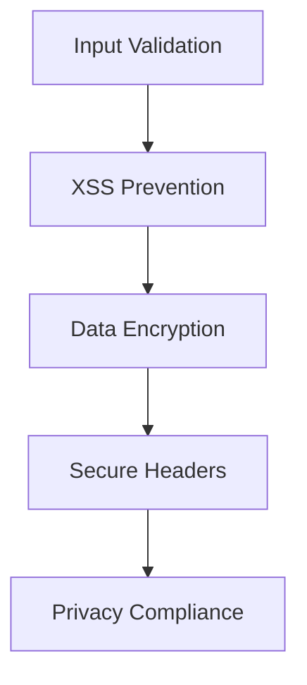

**Security Checklist:**

- [ ] Form input sanitization
- [ ] XSS protection
- [ ] CSRF protection (future backend)
- [ ] HTTPS enforcement
- [ ] Privacy policy implementation
- [ ] GDPR compliance consideration

---

## 📞 Support & Documentation

### 10.9 Documentation Requirements

- [ ] User manual (multiple languages)
- [ ] Developer documentation
- [ ] API documentation (future)
- [ ] Deployment guide
- [ ] Troubleshooting guide

### 10.10 Support System

- [ ] Help desk setup
- [ ] FAQ section
- [ ] Video tutorials
- [ ] Multi-language support documents
- [ ] Community forum (future)

---

## 🎯 Conclusion

This flowchart provides a comprehensive roadmap for developing a government service platform like Shelter Link. The development follows a structured approach from planning to deployment, ensuring scalability, accessibility, and user-centered design.

**Key Success Factors:**

1. **User-Centric Design**: Focus on migrant workers' needs
2. **Multi-language Support**: Breaking language barriers
3. **Mobile-First Approach**: Considering primary device usage
4. **Progressive Enhancement**: Building for future scalability
5. **Government Compliance**: Meeting official standards

**Estimated Timeline:** 4-6 months for MVP, 12+ months for full-featured platform

**Team Requirements:**

- Frontend Developer (2-3 developers)
- UI/UX Designer (1 designer)
- Project Manager (1 PM)
- QA Tester (1 tester)
- Content Creator/Translator (for multi-language)

This flowchart serves as a blueprint for similar government service platforms and can be adapted for various public service digitization projects.
